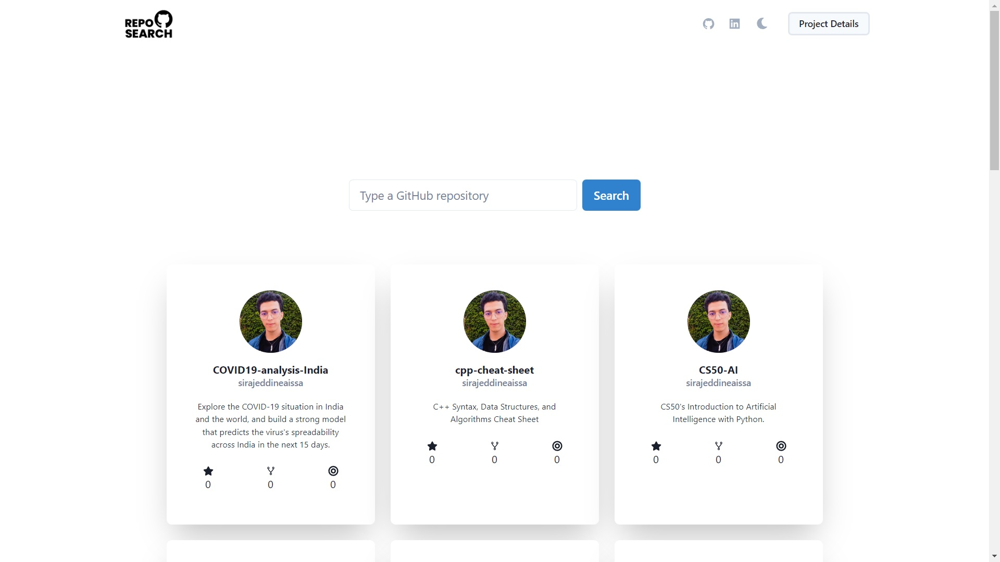
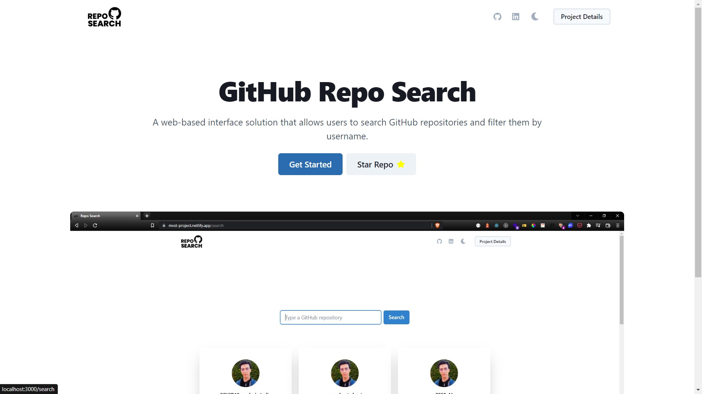
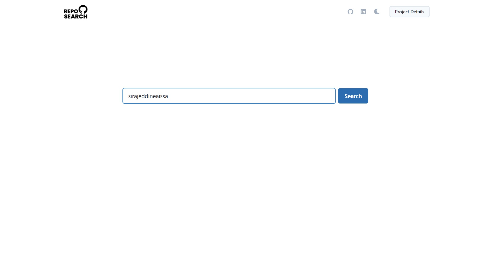
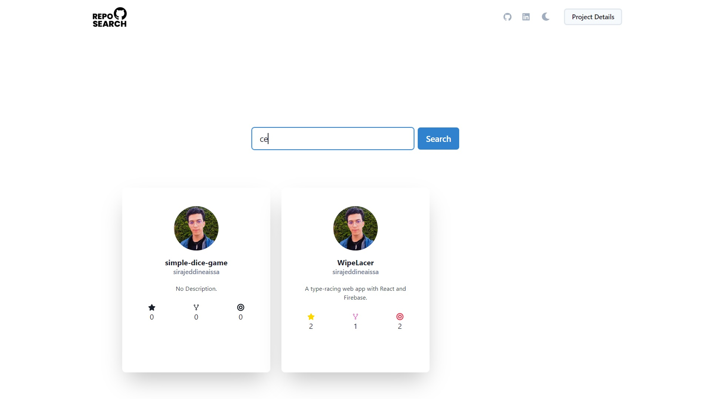
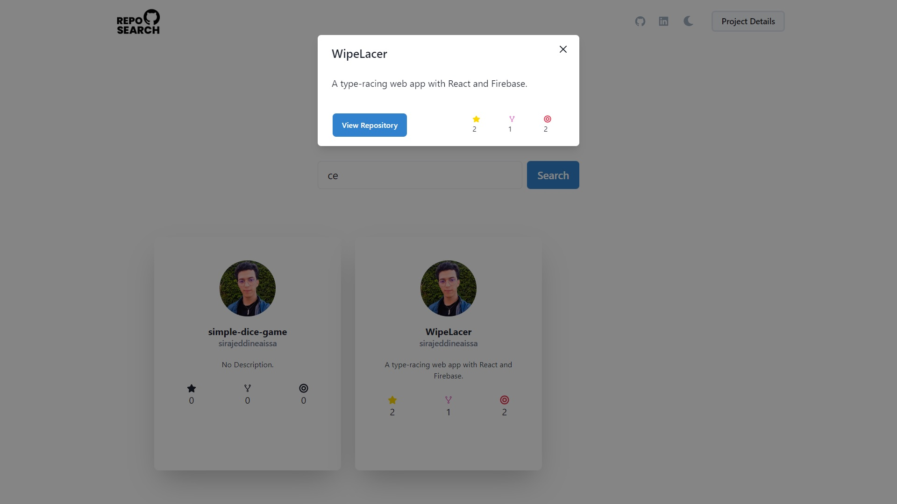
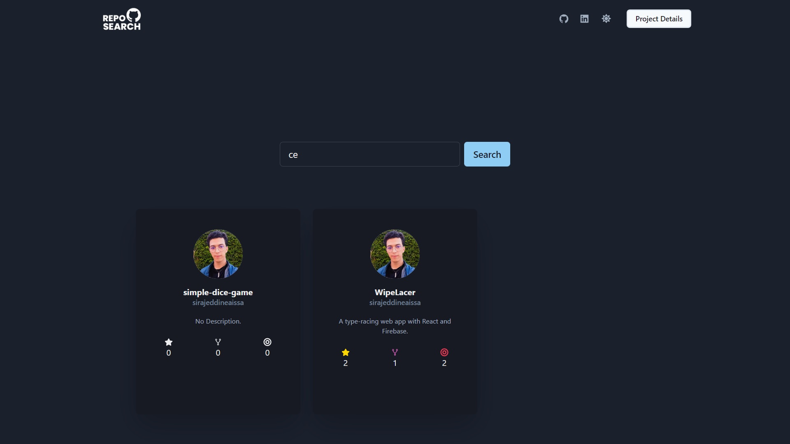

<div align="center">
    

  <h2 align="center">GitHub Repo Search</h2>

  <p align="center">
A web-based interface solution that allows users to search GitHub repositories and filter them by username.    <br />
    <br />
    <br />
    <a href="https://mvst-project.netlify.app">View Demo</a>
    ·
    <a href="https://github.com/sirajeddineaissa/github-repo-search/issues">Report Bug</a>
    ·
    <a href="https://github.com/sirajeddineaissa/github-repo-search/issues">Request Feature</a>
  </p>
</div>

<details>
  <summary>Table of Content</summary>
  <ol>
    <li>
      <a href="#about-the-project">About The Project</a>
      <ul>
        <li><a href="#technologies">Technologies</a></li>
      </ul>
    </li>
    <li>
      <a href="#getting-started">Getting Started</a>
      <ul>
        <li><a href="#prerequisites">Prerequisites</a></li>
        <li><a href="#installation">Installation</a></li>
      </ul>
    </li>
    <li><a href="#usage">Usage</a></li>
    <li><a href="#roadmap">Roadmap</a></li>
    <li><a href="#contribute">Contribute</a></li>
    <li><a href="#license">License</a></li>
  </ol>
</details>

## About The Project



A web-based interface solution that allows users to search GitHub repositories and filter them by username.

### Technologies

This section should list any major frameworks/libraries used to bootstrap your project. Leave any add-ons/plugins for the acknowledgements section. Here are a few examples.

- 
- 

## Getting Started

### Prerequisites

Use the Yarn Package Manager

- Install Yarn

```sh
 npm install -g yarn
```

### Installation

1. Clone the repository
   ```sh
   git clone https://github.com/sirajeddineaissa/github-repo-search
   ```
2. Install dependencies
   ```sh
   yarn install
   ```

## Usage


<br />

<br />

<br />

<br />


## Roadmap

- [x] Added Light/Dark Mode support
- [x] Added GitHub user search feature
- [x] Added GitHub repository search and filtering feature
- [ ] Make it possible to see similar repositories to the searched repository

## Contribute

1. Fork the Project
2. Create your Feature Branch (`git checkout -b feature/feature-name`)
3. Commit your Changes (`git commit -m 'commit text here'`)
4. Push to the Branch (`git push origin feature/feature-name`)
5. Open a Pull Request

Make sure you give this project a ⭐.

## License

Distributed under the MIT License. Check `LICENSE.txt` for more information.
